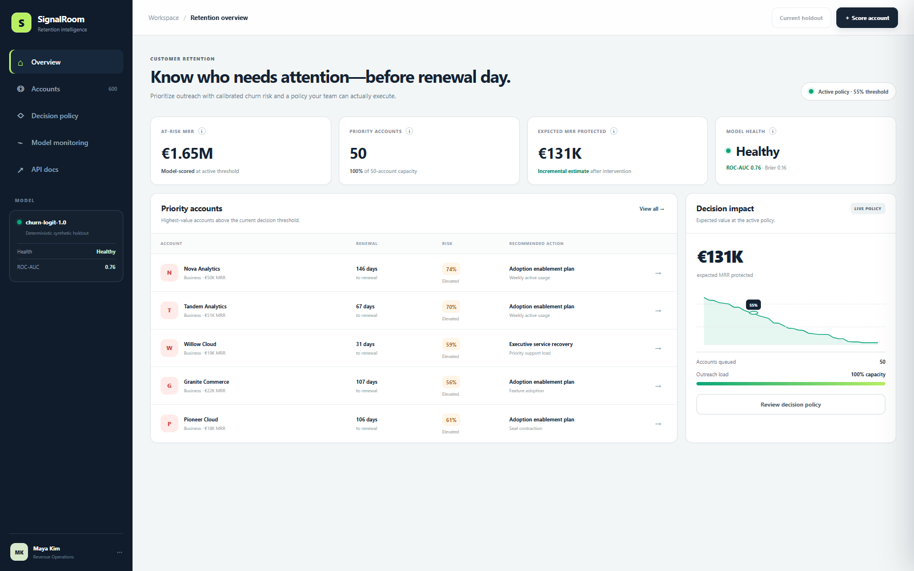
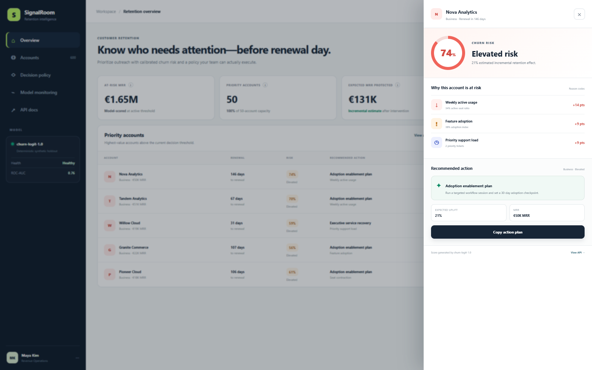

# SignalRoom

SignalRoom is a runnable customer-retention decision system. It trains a churn
model and a two-model treatment-effect estimator, scores a held-out account
population, and turns the output into a capacity-constrained outreach queue.

The interface is backed by the API: changing account signals changes the model
score, moving the risk threshold recalculates policy outcomes, and applying a
policy persists it across refreshes.





## Why this is more than a churn dashboard

A churn score answers *who may leave*. It does not answer *who is worth
contacting*. SignalRoom keeps those questions separate:

1. A logistic classifier estimates churn risk.
2. Two outcome models estimate retention under intervention and no intervention.
3. Their difference is the estimated incremental treatment effect.
4. Expected protected MRR is `max(uplift, 0) × MRR`.
5. The policy removes negative-net-value interventions, ranks the remainder by
   expected net value, and applies the outreach-capacity limit.

This prevents a common failure mode: filling the queue with high-risk accounts
that the modeled intervention is unlikely to help.

## Run locally

Requires Python 3.11 or newer.

```bash
python -m venv .venv
# Windows: .venv\Scripts\activate
# macOS/Linux: source .venv/bin/activate
pip install -e ".[dev]"
python -m signalroom.training
uvicorn signalroom.main:app --reload
```

Open `http://127.0.0.1:8000`. Interactive API documentation is available at
`http://127.0.0.1:8000/docs`.

Or use Docker:

```bash
docker compose up --build
```

## API surface

| Endpoint | Purpose |
|---|---|
| `GET /api/summary` | Active policy, outcomes, model status and priority accounts |
| `GET /api/accounts` | Ranked held-out account population |
| `GET /api/accounts/{id}` | Score, reason codes, uplift and recommended action |
| `POST /api/score` | Score a new account from current signals |
| `GET /api/policy/curve` | Recalculate value/load/precision/recall by threshold |
| `PUT /api/policy` | Persist the active threshold and capacity |
| `GET /api/monitoring` | Held-out discrimination, calibration and stability metrics |

## Reproducibility and evidence

- The default seed is `42`.
- The generator creates 2,400 accounts and uses a stratified 75/25 split.
- Treatment assignment in the synthetic data is randomized.
- The committed model card records the default-seed evaluation.
- Runtime models, metrics, account data and policy state are generated into
  `data/runtime/` and are intentionally not committed.
- CI retrains from scratch before running the tests.

## Important limitation

The dataset is synthetic and is included to make the whole decision path
reproducible without publishing customer data. The treatment-effect estimate
is valid only inside that synthetic randomized data-generating process. It is
not evidence that the policy would cause the same retention lift in a real
business. A production rollout would require a randomized experiment,
intervention-cost validation, temporal backtesting, and live drift monitoring.

See [the model card](docs/model-card.md) and
[architecture notes](docs/architecture.md) for the full design and limits.

## Quality gates

```bash
ruff check .
pytest --cov=signalroom --cov-fail-under=85
node --check app.js
docker compose config -q
```

