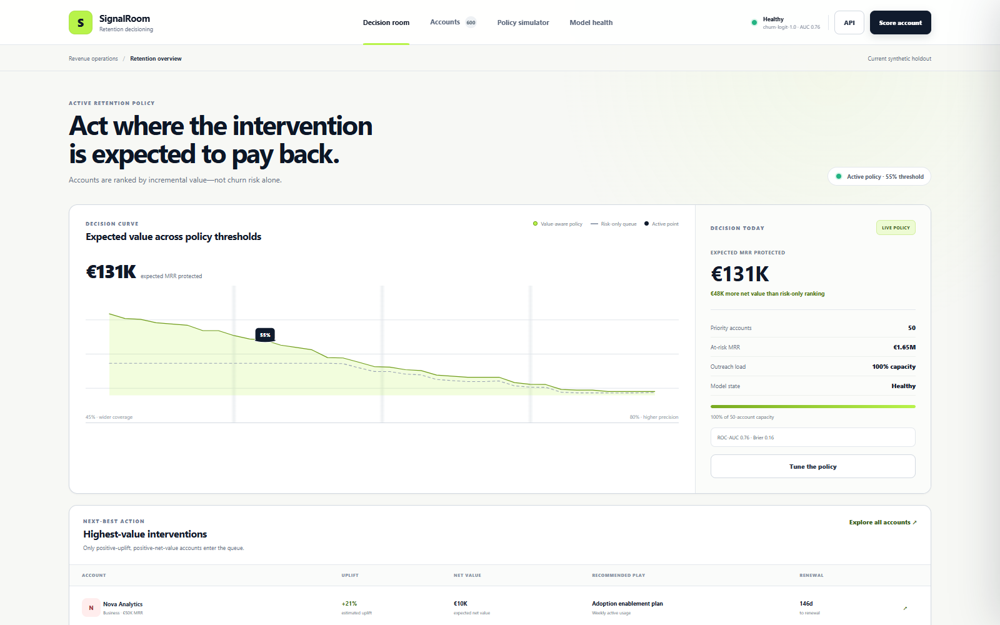
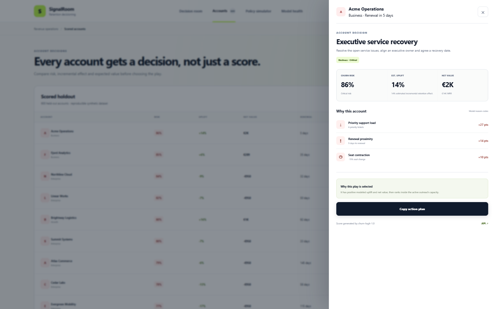
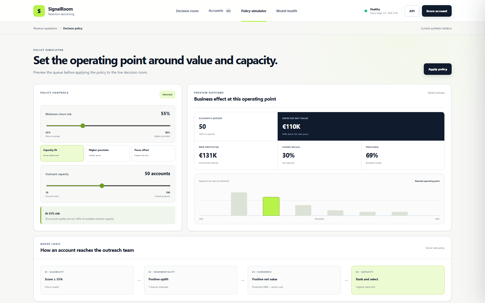
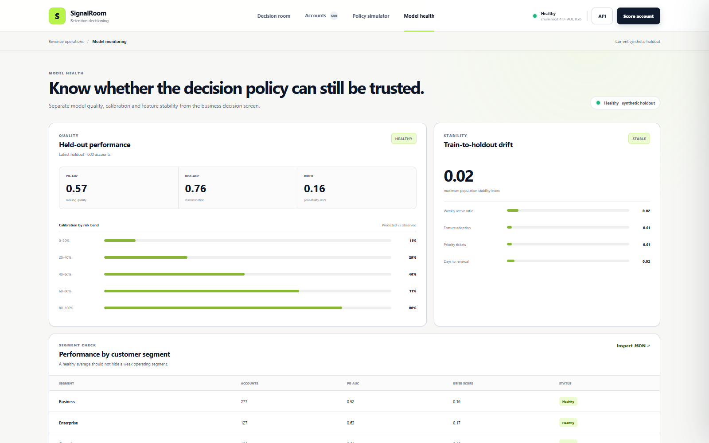

# SignalRoom

[](https://github.com/sutasmantas/retention-decisioning/actions/workflows/ci.yml)
[](pyproject.toml)
[](.github/workflows/ci.yml)
[](LICENSE)

**Choose retention interventions by expected incremental value—not churn risk
alone.**

SignalRoom trains a churn model and a T-learner treatment-effect estimator,
scores a held-out account population, and turns the results into a
capacity-constrained next-best-action queue. The decision room makes the
business policy visible: risk, predicted uplift, customer value, action cost,
threshold and team capacity all affect who receives outreach.



## Try the policy

[](https://codespaces.new/sutasmantas/retention-decisioning?quickstart=1)
[](https://render.com/deploy?repo=https://github.com/sutasmantas/retention-decisioning)

The no-credential demo is fully API-backed:

- move the churn-risk threshold and outreach-capacity controls;
- compare the value-aware policy with a queue ranked only by churn risk;
- apply a policy and confirm it persists across refreshes;
- inspect account-level risk, uplift, expected net value and reason codes;
- change live account signals and run the model;
- review held-out discrimination, calibration, segment quality and drift.

The default deterministic dataset shows why ranking high-risk accounts is not
enough: some customers are unlikely to respond to the intervention, and some
actions cost more than the value they are expected to protect.

<details>
<summary>Account, policy and model-health screens</summary>







</details>

## Decision logic

1. A logistic classifier estimates churn risk.
2. Separate treated and control outcome models estimate retention under each
   condition.
3. Their difference is the estimated incremental treatment effect.
4. Expected protected MRR is `max(uplift, 0) × MRR`.
5. Expected net value subtracts the modeled action cost.
6. The policy removes negative-uplift and negative-value candidates, ranks the
   remainder by expected net value, then applies the outreach-capacity limit.
7. A risk-only baseline ranks the same eligible risk pool by churn probability
   so the incremental value of decisioning is directly inspectable.

This keeps three questions separate: who may leave, whose outcome may change,
and where limited retention effort is expected to pay back.

## Run locally

Requires Python 3.11 or newer.

```bash
python -m venv .venv
# Windows: .venv\Scripts\activate
# macOS/Linux: source .venv/bin/activate
pip install -e ".[dev]"
python -m signalroom.training
uvicorn signalroom.main:app --reload
```

Open <http://127.0.0.1:8000>. The OpenAPI reference is available at
<http://127.0.0.1:8000/docs>.

Or run the same training and service path in Docker:

```bash
docker compose up --build
```

## API

| Endpoint | Purpose |
|---|---|
| `GET /api/summary` | Active policy, value-aware outcome, risk-only baseline and priority accounts |
| `GET /api/accounts` | Scored held-out population |
| `GET /api/accounts/{id}` | Risk, uplift, net value, reasons and recommended play |
| `POST /api/score` | Score a new account from current signals |
| `GET /api/policy/curve` | Compare value-aware and risk-only value across thresholds |
| `PUT /api/policy` | Persist threshold and outreach capacity |
| `GET /api/monitoring` | Held-out discrimination, calibration, segment and stability metrics |

## Reproducibility

- Default seed: `42`.
- Generated accounts: 2,400.
- Split: stratified 75/25 train and untouched holdout.
- Synthetic treatment assignment: randomized.
- Runtime models, metrics, accounts and policy are generated into
  `data/runtime/` and are intentionally not committed.
- CI retrains from scratch before testing.
- The committed [model card](docs/model-card.md) records the default-seed
  evaluation and promotion gates.

## Verification

```bash
ruff check .
pytest --cov=signalroom --cov-fail-under=85
node --check app.js
docker compose config -q
```

Tests cover deterministic generation, randomized treatment, value and capacity
gates, the risk-only comparator, account scoring, policy persistence, account
detail, monitoring artifacts and API validation.

## Important limitation

The dataset is synthetic so the full decision path can be reproduced without
publishing customer data. Treatment-effect estimates are causally interpretable
only inside that randomized synthetic data-generating process. A production
rollout requires a real randomized intervention, time-based validation,
calibrated operational costs, outcome logging and live drift monitoring.

See [architecture notes](docs/architecture.md) and the
[model card](docs/model-card.md) for the full boundary.

## License

MIT
