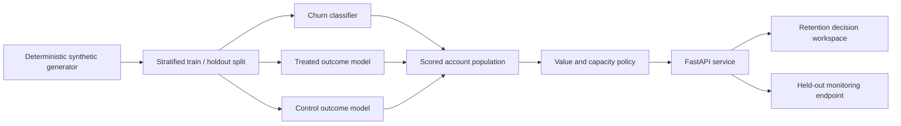

# Architecture



## Training path

`signalroom.training` generates the data, fits all three pipelines, evaluates
the untouched holdout, scores that population, and writes four runtime
artifacts:

- `models.joblib`
- `metrics.json`
- `accounts.csv`
- `policy.json`

All categorical handling and numeric scaling live inside scikit-learn
pipelines, so training and inference use the same transformations.

## Decision path

The API calculates:

```text
churn risk = P(churn | account features)
uplift = P(retained | treated, features) - P(retained | control, features)
expected protected MRR = max(uplift, 0) × MRR
expected net value = expected protected MRR - action cost
```

An account enters the queue only when it clears the active risk threshold,
has positive uplift, and has positive expected net value. Eligible accounts
are then ranked by expected net value and truncated at the capacity limit.

## Explainability

The UI labels its explanations as input-based reason codes. They are
deterministic summaries of risky feature values, not SHAP values or causal
attributions. The churn probability itself comes from the fitted model.

## Production extensions

- Replace the generator with versioned warehouse snapshots.
- Use time-based validation rather than a random split.
- Estimate treatment effect from an actual randomized intervention.
- Calibrate action costs from operational data.
- Log scores, features, policy versions and realized outcomes.
- Add authentication, tenant isolation, audit logs and scheduled retraining.

